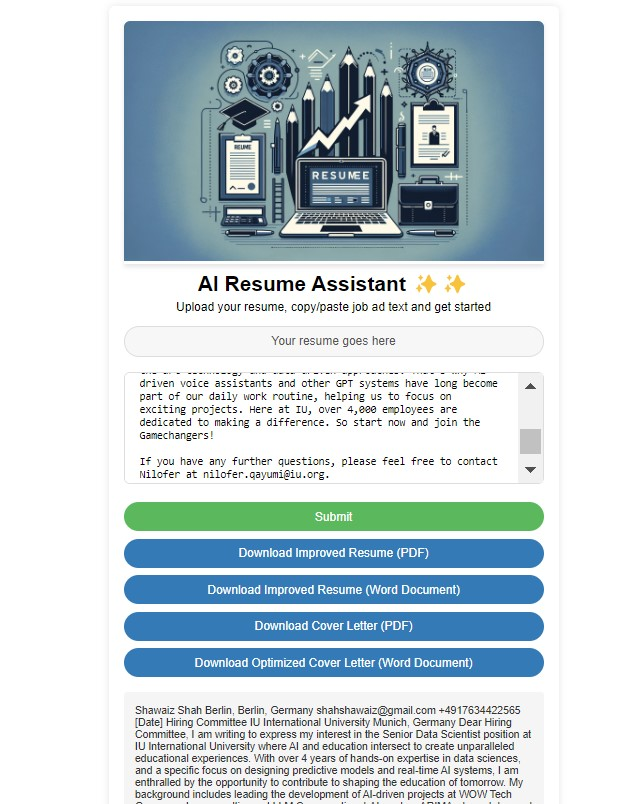

# Up And Running

## 1. Clone Project
git clone <repository_url>

## 2. Build the app.
docker build --no-cache -t resume-generator .

## 3. Run App.
docker run -p 3000:3000 -p 5000:5000 resume-generator

